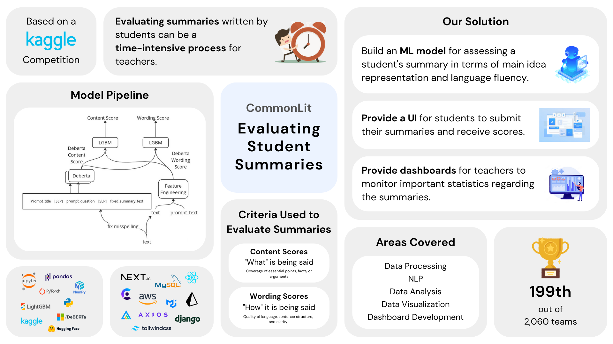

# Evalutaing Student Summaries

<!-- Add image -->

## Background

This is the code repository of Group 14 for CS3501: Data Science and Engineering Project at University of Moratuwa.

### Problem Statement

This project aims to address the challenge of assessing the quality of summaries created by students in grades 3-12. The objective is to develop a model capable of objectively evaluating the effectiveness of student-written summaries in terms of capturing the core concepts and details of a source text, while also assessing the clarity, precision, and fluency of the language used in the summary. The availability of a dataset comprising genuine student summaries will facilitate the training of this model.

## Getting Started

### Installation

Open command line and run the following commands to setup

1. `https://github.com/dan-niles/dse-project-frontend.git`
2. `cd dse-project-frontend`

To install frontend

1. `cd frontend`
2. `npm install`

To install backend

1. `cd backend`
2. `pipenv shell` (Note: if you havent install it install pipenv using `pip install pipenv `)
3. `pipenv install`

### Running

Start backend

1. `cd backend`
2. `pyhton manage.py runserver`

Start frontend

1. `cd frontend`
2. `npm start`
